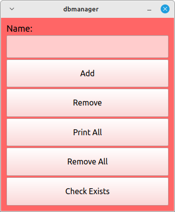
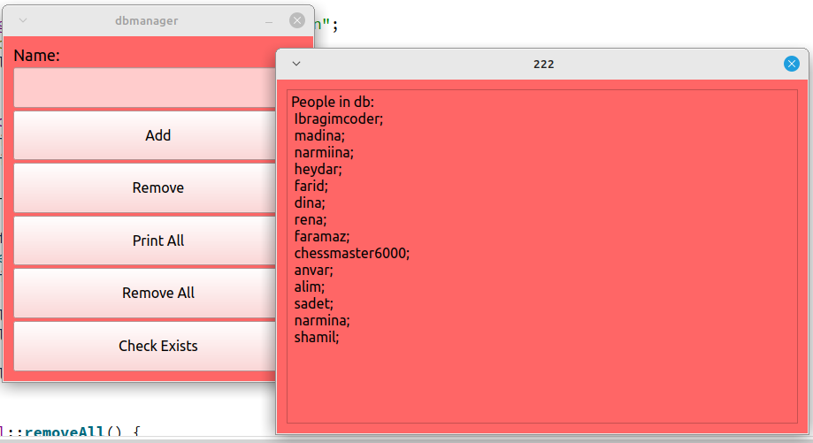

# Проект "Управление базой данных"

Этот проект представляет собой простое приложение для управления базой данных людей. Он предоставляет пользовательский интерфейс для добавления, удаления, проверки существования и вывода всех записей в базе данных.

## Описание
Проект состоит из двух основных компонентов: класса Visual для создания графического интерфейса пользователя и класса DbManager для взаимодействия с базой данных SQLite.

### Visual
Класс Visual отвечает за создание и управление пользовательским интерфейсом. Он содержит элементы управления для добавления, удаления, вывода всех записей и проверки существования человека в базе данных.

### Функции:
1) `addPerson()`: Добавляет новую запись в базу данных с указанным именем.

2) `removePerson()`: Удаляет запись из базы данных по указанному имени.

3) `printAll()`: Выводит все записи из базы данных.

4) `removeAll()`: Удаляет все записи из базы данных.

5) `сheckPersonExists()`: Проверяет существует ли запись с указанным именем в базе данных.

6) `tableView()`: Инициализирует пользовательский интерфейс с элементами управления.

## DbManager
Класс DbManager обеспечивает взаимодействие с базой данных SQLite. Он предоставляет методы для создания базы данных, добавления, удаления и проверки существования записей, а также для вывода всех записей в консоль.

### Функции:
1) `DbManager()`: Конструктор класса, инициализирует соединение с базой данных и создает таблицу, если она не существует.
 
2) `createDatabase()`: Создает таблицу "people" в базе данных, если она не существует.
 
3) `addPerson()`: Добавляет новую запись в базу данных с указанным именем.
 
4) `personExists()`: Проверяет существует ли запись с указанным именем в базе данных.
  
5) `removePerson()`: Удаляет запись из базы данных по указанному имени.
  
6) `printAll()`: Выводит все записи из базы данных в консоль.

    
7) `removeAll()`: Удаляет все записи из базы данных.
    
8) `~DbManager()`: Деструктор класса, закрывает соединение с базой данных при уничтожении объекта.
